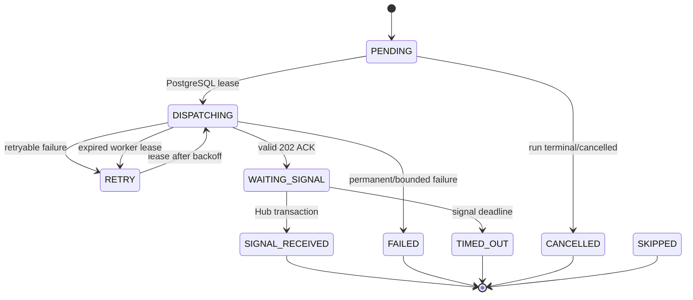

# Agent task lifecycle

One task is exactly one agent + one asset + one snapshot + one capability. A task ID is stable
across dispatch attempts. ABSTAIN is a valid final result and completes a task. HTTP ACK does not.

FULL requires every planned task result and no planning gap. DEGRADED requires every required
capability minimum but permits optional/non-critical loss. CRITICAL with `INSUFFICIENT_DATA` means
a required minimum or explicitly critical assignment cannot be met. This is collection quorum,
not majority voting over analytical opinions.
