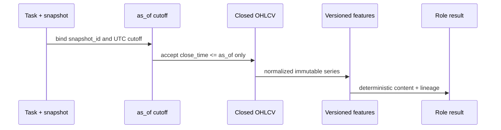

# Analysis replayability and lookahead safety

Every analysis has an explicit UTC `as_of` cutoff. The provider requests data ending at that
cutoff, excludes the current open candle, and the quality gate rejects any bar closing after it.
Multi-timeframe series are keyed by `(instrument, timeframe)` rather than special `data_1h` fields.

Given identical market data, snapshot, cutoff, role version, config version and feature versions,
analytical content is identical. Transport message/run UUIDs and wall-clock delivery timestamps are
operational metadata and may differ. A historical cutoff is allowed when explicitly supplied; only
a cutoff in the future is rejected. Each result records the provider plus first/last bar and count
for every timeframe in bounded `data_ranges` metadata. Raw data arrays are not logged. Replaying
later therefore requires retaining or reconstructing the exact external dataset; Phase 03
intentionally does not provide a historical candle warehouse.
