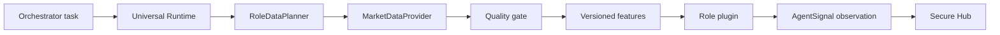

# Analytical agent framework

Phase 03 adds replaceable analytical plugins to the Phase 02 Universal Agent Runtime. HTTP, HMAC,
task idempotency, Hub delivery and health remain runtime concerns. A role receives only a bounded
`RoleInput` and returns a deterministic `AgentAnalysisResult`; it never opens sockets or reads
secrets.

`AgentRoleRegistry` is the extension point. Runtime core asks it to build the configured `role_id`;
there are no asset branches in Runtime, Hub or Orchestrator. The API version is
`ANALYTICAL_ROLE_API_VERSION = "1"`. Unknown, duplicate, disabled or incompatible roles fail
startup. `AgentDefinition` owns identity, capabilities, assets, data requirements, parameters,
limits and `config_version`.

One Space is one deployment unit. A shared immutable code release can contain many role versions,
while each Space selects one definition. Updating ETH therefore does not require restarting BTC or
SOL.

An `AgentSignal` is an analytical observation. It is not a trade decision and cannot include an
entry, order, position size, leverage, stop loss or take profit.
