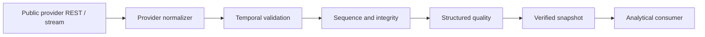

# TOMIRIS Market Data Plane

Phase 04 extends the Phase 03 OHLCV provider without changing its consumer contract. It is a
public-data subsystem only. It has no account, credential, order, position, leverage, Chief,
Judge, Risk, or execution interface.

The provider registry routes `(market_type, data_type)` through declared capabilities. Consumers
never import Binance payloads. Adding Bybit therefore means adding an adapter, capabilities,
configuration, and contract tests; ETH/SOL roles remain unchanged.

Canonical identity is `VENUE:MARKET_TYPE:SYMBOL`. Thus `BINANCE:SPOT:BTCUSDT` and
`BINANCE:USDT_M_FUTURES:BTCUSDT` cannot compare equal. The identity also carries base, quote, and
contract type.

REST is used for history, metadata, bootstrap, server time, and recovery. `MarketDataStream` owns
incremental connection lifecycle. `NormalizedMarketEvent` is the only stream-facing domain
envelope and distinguishes event, exchange, receive, process, and snapshot-cutoff times.

The recent event store is deliberately bounded by item count and bytes. Eviction is expected. It
is not durable truth and PostgreSQL is not used as a tick warehouse. A future durable stream store
can implement the same interface.

## Operational boundary

- Production REST and WebSocket origins require TLS, approved hosts, no URL credentials, bounded
  payloads, and public/global DNS results.
- Local HTTP/WS is accepted only by explicit test/development override.
- Reconnect uses bounded exponential backoff and jitter. Queues do not grow without limit.
- Connection liveness and data freshness are separate health properties.
- Provider errors retain machine-readable reason codes; no malformed payload becomes neutral data.

Configuration is validated by `MarketDataPlaneSettings`. Metrics use provider, market type, and
data type labels—never event IDs or snapshot UUIDs.
