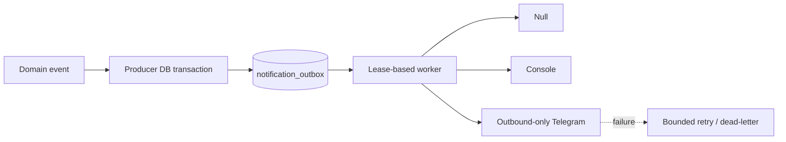
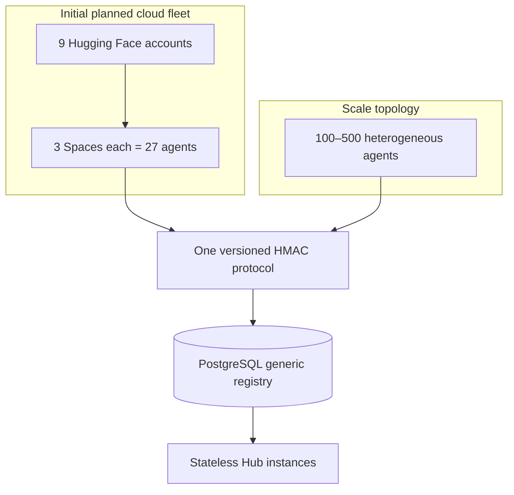
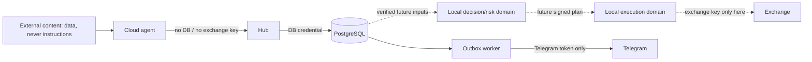

# TOMIRIS master architecture

## Phase 01 scope

Phase 01 is a secure, durable ingestion and notification foundation. It contains no market
collectors, exchange connectivity, trading, portfolio decisions, risk sizing, backtesting,
learning, LLMs, Orchestrator, Chief, Debate, or Judge.

## System context and future direction

```mermaid
flowchart LR
  subgraph Cloud[Untrusted cloud analysis boundary]
    DS[Future data sources] --> AF[N specialized agents]
  end
  subgraph Foundation[Phase 01 implemented]
    AF -->|HTTPS + HMAC AgentSignal| HUB[Secure Hub]
    HUB --> PG[(PostgreSQL)]
    PG --> OUT[Notification outbox]
    OUT --> NG[Outbound notification gateway]
  end
  subgraph Local[Future local privileged boundary]
    DQ[Data Quality] --> INT[Intelligence] --> REG[Market Regime]
    REG --> SR[Strategy Router] --> CH[Chief Trader]
    CH --> DEB[Debate / Devil's Advocate] --> J[Judge]
    J --> R[Risk Constitution] --> EX[Execution Reality]
    EX --> VENUE[Binance] --> GUARD[Portfolio Guardian]
    GUARD --> PTA[Post-trade Analytics] --> LEARN[Learning]
  end
  PG -. future verified snapshot .-> DQ
```



Only the Foundation box exists. Future components shown here are contracts and trust boundaries,
not empty packages or working features.

## Data and decision flow

```text
DATA SOURCES -> SPECIALIZED AGENTS -> SECURE HUB -> DATA QUALITY
-> SNAPSHOT / PROVENANCE -> INTELLIGENCE -> MARKET REGIME -> STRATEGY ROUTER
-> CHIEF TRADER -> DEBATE -> JUDGE -> RISK CONSTITUTION -> EXECUTION REALITY
-> BINANCE -> PORTFOLIO GUARDIAN -> POST-TRADE ANALYTICS -> LEARNING
```

```mermaid
sequenceDiagram
  participant A as Agent
  participant H as Secure Hub
  participant P as PostgreSQL
  A->>H: bounded raw body + HMAC headers
  H->>H: time/HMAC/schema/registry/snapshot checks
  H->>P: BEGIN; nonce + AgentSignal + audit
  alt all durable
    P-->>H: COMMIT
    H-->>A: 202 ACCEPTED
  else any ambiguity/failure
    P-->>H: ROLLBACK
    H-->>A: controlled reject; never false ACCEPTED
  end
```

PostgreSQL is the final replay and atomicity boundary. Notifications have no authority over Hub
state. `AgentSignal` can never become an exchange order directly. The future mandatory path is
Agent → Hub → Chief → Judge → Risk → Execution, with Data Quality and Risk holding veto authority.

## Notification flow



## Module boundaries

- `tomiris_common`: dependency-light bounded JSON validation.
- `tomiris_core_contracts`: transport-neutral signal, snapshot, evidence, and notification contracts.
- `tomiris_hub`: HTTP trust boundary, authentication, registry/snapshot policy, persistence.
- `tomiris_notifications`: outbox enqueue/worker and outbound adapters.
- `tomiris_agent_sdk`: canonical HMAC signing for future external agents.

Dependencies point toward contracts/common. The Hub does not import Telegram. Telegram receives
only notification content and its own token; it never receives database or exchange credentials.

## Domain contracts

| Concept | Phase 01 state |
| --- | --- |
| `AgentSignal` / compatible `SignalEnvelope` | strict contract and durable record |
| `MarketSnapshot` | strict contract and durable synchronization record |
| `EvidenceItem` | strict provenance-bearing contract |
| `NotificationEvent` | strict outbound event contract |
| `IntelligencePacket`, `StrategyCandidate`, `ChiefOpinion` | documented future concepts only |
| `DebateResult`, `JudgeDecision`, `RiskDecision` | documented future concepts only |
| `ExecutionPlan`, `ExecutionReport`, `TradeLifecycleEvent` | documented future concepts only |

## N-agent topology



The Hub contains no constant for 27. Adding agents changes reviewed registry rows, not core logic.
Capabilities, criticality, supported assets, and evidence types limit each identity.

## Trust and local/cloud boundaries



External content cannot change policy, request secrets, assign roles, or create orders. Compromise
of an agent does not grant DB access; compromise of Telegram does not grant decision/execution
authority; future exchange credentials remain only in local Execution.

## Data ownership

`agents` is bootstrapped from reviewed YAML. `market_snapshots` is only populated by a Phase 01
system-test utility. `used_nonces`, `signals`, and `audit_events` are durable PostgreSQL evidence.
`notification_outbox` owns delivery state. Correlation and causation UUIDs connect records without
granting causal truth.

## Failure boundaries and deployment

Hub authentication/validation failure stops before business persistence. A database failure rolls
back nonce, signal, and accepted audit together and makes readiness false. A notification failure
is contained to its outbox state. Future Data Quality can veto analytics; future Risk can veto
Chief/Judge; neither failure may become optimistic acceptance.

One Hub process and one or more workers may share PostgreSQL. Workers claim with
`FOR UPDATE SKIP LOCKED`. Migrations run before registry bootstrap and startup. See
[`FAILURE_MATRIX.md`](FAILURE_MATRIX.md) and [`THREAT_MODEL.md`](THREAT_MODEL.md).

## Phase 02 nervous system

Phase 02 adds durable `orchestration_runs` and `agent_tasks`, deployment-only
`agent_endpoints`, and observational `agent_runtime_states`. The Orchestrator selects agents from
reviewed capability/asset registry data and never embeds a 27-agent topology. A signed command
produces only a 202 ACK; a separately signed task-bound signal completes work atomically in the
Hub transaction.

Completeness has three terminal states: FULL, DEGRADED and CRITICAL. CRITICAL carries
`INSUFFICIENT_DATA` and blocks any future decision pipeline. These states express coverage, not a
LONG/SHORT vote. See [`ORCHESTRATOR_ARCHITECTURE.md`](ORCHESTRATOR_ARCHITECTURE.md).
