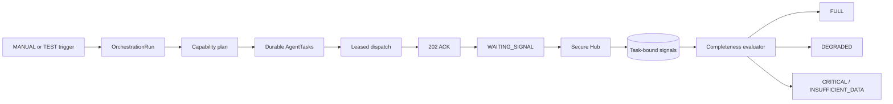
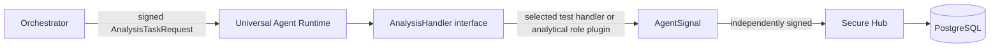

# Phase 02 orchestrator architecture

The Orchestrator is a durable coordination service. It chooses registered agents by capability,
creates one task per agent/asset/snapshot/capability, dispatches signed commands, and evaluates
collection completeness. It never interprets LONG/SHORT, calculates indicators, or creates an
order.

The logical registry (`agents`) describes authorized identity, capabilities and assets.
`agent_endpoints` describes deployment. `agent_runtime_states` describes current availability,
latency and circuit state. Runtime handshake data can reveal drift but can never grant itself a
new capability.

PostgreSQL is the coordination authority. Dispatch uses row locks with `SKIP LOCKED` and expiring
leases. Hub signal acceptance and task completion share one transaction. A bounded reconciliation
pass repairs interrupted states after restart. No Redis, Kafka, keep-alive traffic or fixed
agent-count branch exists.

Operational metrics cover run/task counts, retries, circuit opens, ACK latency and signal latency.
They deliberately do not claim analytical or trading accuracy.

Phase 03 keeps this orchestration boundary unchanged. Analytical mode loads a versioned,
declarative role through the same runtime interface; test mode remains available for deterministic
orchestration regression tests. Neither mode gives the Orchestrator analytical voting or trading
responsibilities.
