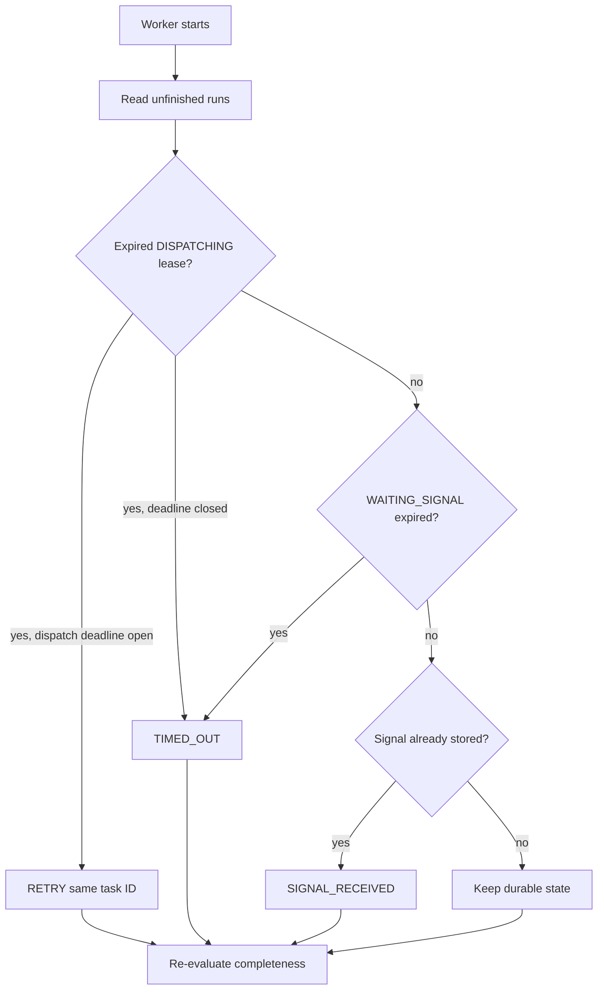

# Orchestrator recovery

On startup a bounded PostgreSQL reconciliation pass finds unfinished runs and their tasks. It
reclaims expired DISPATCHING leases, preserves active leases, expires missed signal deadlines, and
reconciles a task when its signal already exists. It never creates a replacement run or changes a
task ID.

Every unfinished run is re-evaluated even when no task row needs repair. This closes the crash
window where every task was already terminal but the run had not yet been finalized.

`ORCHESTRATION_RECOVERED` records a material repair. Polling is bounded and configurable, using
indexed task/run status, dispatch time and lease columns. This Phase intentionally avoids another
state system such as Redis or Kafka.
