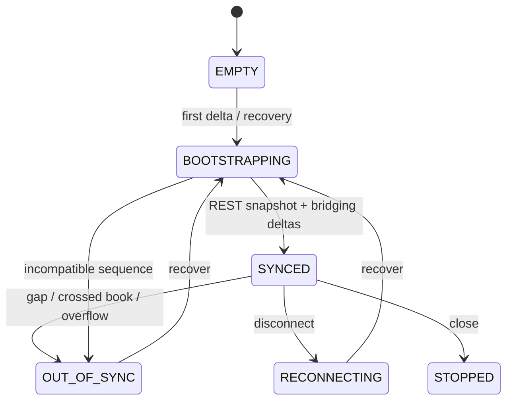

# Order Book Synchronization

`OrderBookSynchronizer` implements an atomic, Binance-compatible snapshot-and-delta state machine.

The initial stream deltas are buffered while a REST snapshot is fetched. Deltas ending at or
before `last_update_id` are discarded as old/duplicate. The first usable delta must bridge
`last_update_id + 1`; subsequent futures updates must also match `previous_final_update_id` when
the provider supplies it. Each price level update is applied once.

A missing update, identity mismatch, crossed/empty book, or bounded-buffer overflow fails closed.
The book becomes `OUT_OF_SYNC` and `safe_for_analysis=false`. Later deltas are not treated as a
trusted continuation. `recover()` marks bootstrap in progress, fetches a fresh REST snapshot, then
replays compatible buffered deltas atomically.

The recovery buffer is bounded by event count, serialized bytes, and event-time duration. Stream
reconnect similarly requires a fresh synchronization; a TCP/WebSocket reconnect alone never makes
the old book valid.

Book levels use finite `Decimal` values, positive prices, non-negative quantities, bounded depth,
descending bids, ascending asks, and `best_bid < best_ask`. Readers and writers share an async
lock, so no consumer observes a partially applied delta.
